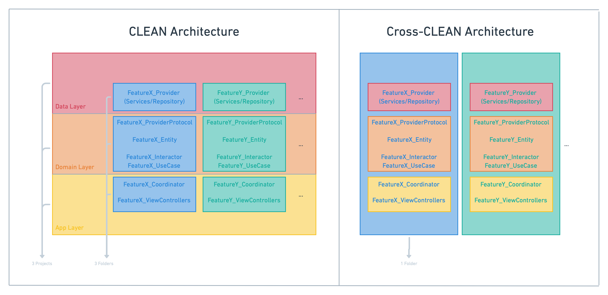

# cross-clean-ios

## Cross-CLEAN Architecture

Cross-platform CLEAN architecture, or simply Cross-CLEAN, is a simplified version of the CLEAN architecture that comes to solve the major issues of a daily basis development day while keeping the fundamental basis of the original architecture intact.

### PROS of the original CLEAN architecture:
- Separation of concerns
- Dependencies injection
- Dependency flow
- Testability
- Is great for building complicated solutions

### CONS of the original CLEAN architecture:
- Project boundary between (Domain/Data/App -) layers 
- Merge conflicts between three different projects
- Hard to understand what is what / Too many moving parts
- Needs onboarding / steep learning curve
- Difficulties coordinating entity identifiers through the layers
- We can't create a new screen using a template
- Building something simple is not fun

### Cross-CLEAN Approach:
- One single project
- Folders being organized by views, and within each folder, each view has its own Domain, Data, and App folders.
- Possibility to add template based on the view(controller) you are creating
- Easier understanding how each view(controller) is built and all its moving parts
- Adding a new view is fast

### Templates

#### Install

Open Terminal and access the root directory of the folder by using `cd Templates`
 `make install_templates`

#### Uninstall

If you wish to uninstall the template just run `make uninstall_templates`.

## iOS Architecture Example:

This should be a simple app, doing only the bare minimum for displaying data while still to adhearing to your architecture of choice (as if it were in production). This app will have two `UIViewControllers` / `Views`. The first view will be a list of all the users that will be returned from a specifc endpoint and filtered by their email, and the second will be a detail view for that user, which shows a list of all of their posts, which are to be fetched from a second endpoint via the user's ID.

### Reqiurements:
Each example app should:
- Get all users from https://jsonplaceholder.typicode.com/users
- Display 3 attributes from each user that has a `.biz` email in a each row of a table
    - company and street
        - `Business on Street`
    - their phone with all non-numeric characters filterd out
        - `01.612.823.6077 #1234`  ->  `0161282360771234`
    - their name & username
        - `someName & someUserName`
- Show user detail view on row tap
    - Display posts from user via their userId in detail view from endpoint https://jsonplaceholder.typicode.com/posts?userId=1
        - Post `title`
        - Post `body`
